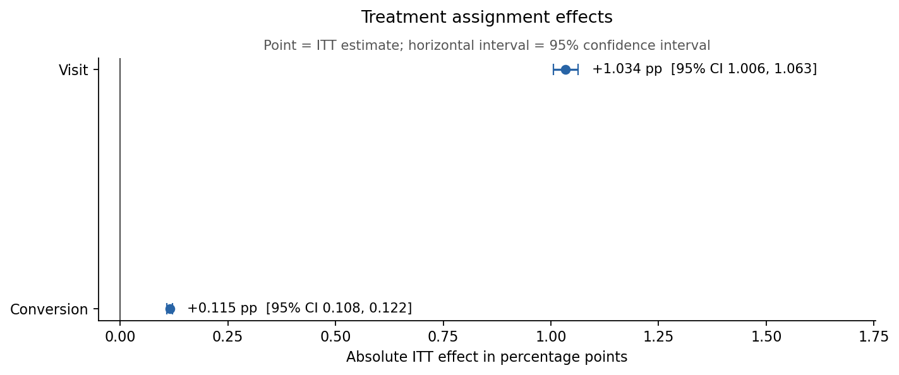
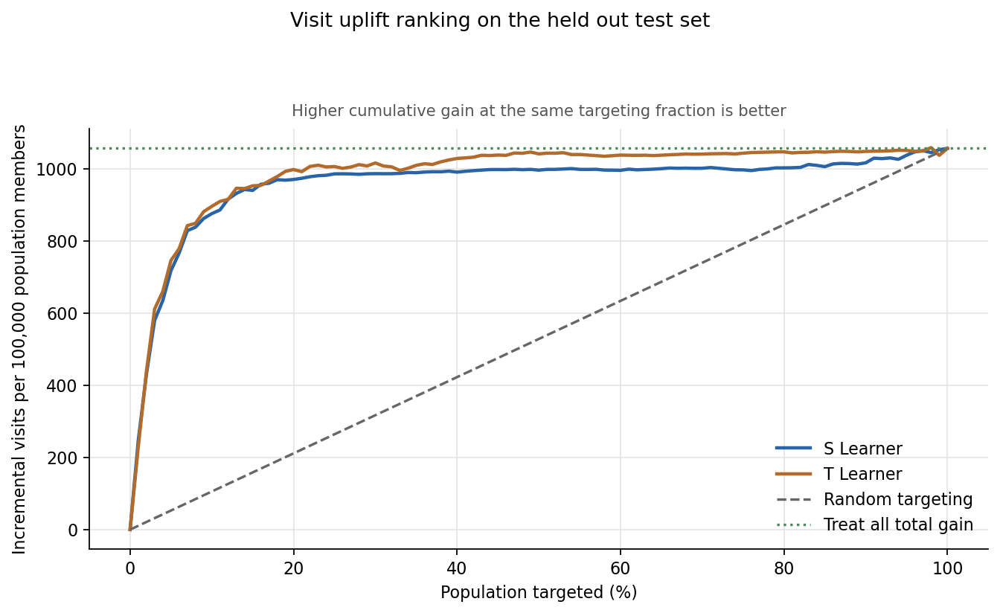
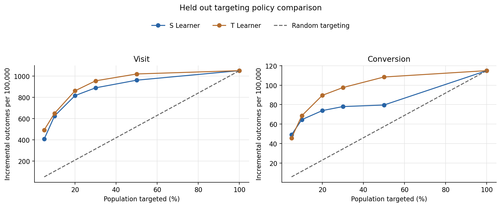

# Criteo Experimentation and Causal Measurement

## Business problem

Advertising teams need to distinguish incremental customer behavior caused by a campaign from outcomes that would have occurred without treatment. Reliable measurement supports budget allocation and audience decisions.

## Analytical objective

This project measures average treatment effects from a randomized advertising experiment and evaluates baseline heterogeneous treatment effect rankings.

## Key results

- The released benchmark contains 13,979,592 observations, and randomized treatment allocation matched the documented 85% treatment and 15% control design.
- Treatment increased the visit rate by 1.034 percentage points and the conversion rate by 0.115 percentage points.
- The T Learner produced the strongest held out uplift ranking for both outcomes.
- Targeting the top 10% with the T Learner produced 649.4 incremental visits per 100,000 population members versus 105.0 under random targeting, and 68.6 incremental conversions versus 11.5 under random targeting.

## Analytical workflow

Acquire data → Validate schema and integrity → Audit randomization → Estimate ITT effects → Evaluate power and MDE → Model heterogeneous treatment effects → Evaluate held out uplift ranking → Compare targeting policies

## Dataset

The project uses the public `CRITEO-UPLIFTv2.1` dataset from the [official Criteo dataset page](https://ailab.criteo.com/criteo-uplift-prediction-dataset/) and its [large scale individual treatment effect and uplift modeling benchmark](https://github.com/criteo-research/large-scale-ITE-UM-benchmark). The current Criteo page states that the dataset uses the [Creative Commons Attribution NonCommercial ShareAlike 4.0 International license](https://creativecommons.org/licenses/by-nc-sa/4.0/) and requests citation of Diemert et al. (2018), *A Large Scale Benchmark for Uplift Modeling*.

The `treatment` column records randomized treatment assignment, while `exposure` records effective advertising exposure after assignment. Treatment assignment is the primary treatment for subsequent causal analysis.

## Analytical scope

The current analysis covers data validation, randomization diagnostics, intention to treat effect estimation, experiment sensitivity, and S Learner and T Learner uplift baselines. The uplift workflow evaluates targeting policies on an untouched test split with inverse propensity weighting for the documented 85% treatment allocation.

## Experiment results

The released benchmark contains 13,979,592 observations. Treatment assignment was 85.000013%, compared with the documented 85% design. The maximum absolute covariate standardized difference was 0.036, below the 0.10 practical threshold. A treatment prediction diagnostic produced a ROC AUC of 0.5046 and log loss of 0.4237, compared with baseline log loss of 0.4217.

| Outcome | Control rate | Treatment rate | ITT effect | 95% CI | Relative lift | MDE 80% | MDE 90% |
| --- | ---: | ---: | ---: | ---: | ---: | ---: | ---: |
| Visit | 3.820% | 4.854% | +1.034 pp | [1.006, 1.063] pp | 27.1% | 0.040 pp | 0.047 pp |
| Conversion | 0.194% | 0.309% | +0.115 pp | [0.108, 0.122] pp | 59.4% | 0.009 pp | 0.011 pp |

The randomization diagnostics are consistent with the documented design. Treatment increased visits and conversions in the released benchmark population, and both effects exceed the corresponding minimum detectable effects. These estimates do not represent original Criteo campaign return on investment or production incrementality.



Run the complete experiment analysis and regenerate its figures:

```bash
criteo-analysis experiment
```

Run the uplift baselines and their held out evaluation:

```bash
criteo-analysis uplift
```

## Uplift modeling results

The uplift baseline uses a reproducible 2,000,000 row sample, split into 60% training, 20% validation, and 20% held out testing. Validation AUUC selects the regularization setting, and the table reports results from the untouched test population.

Only `f0` through `f11` are model features. Treatment assignment, exposure, visits, and conversions are excluded from the predictive covariates. Use `--sample-size` to select a different explicit sample size.

| Outcome | Selected model | AUUC above random | Top 10% policy | Random at 10% | Top 20% policy | Random at 20% |
| --- | --- | ---: | ---: | ---: | ---: | ---: |
| Visit | T Learner | 458.71 | 649.4 | 105.0 | 861.1 | 210.1 |
| Conversion | T Learner | 45.67 | 68.6 | 11.5 | 89.5 | 23.0 |

All gain values are incremental outcomes per 100,000 population members.



In the held out benchmark, the learned rankings concentrated more incremental outcomes than random targeting at the same population fractions. These results describe average ranking performance rather than individual effects.



## Limitations

- Results apply to the released `CRITEO-UPLIFTv2.1` benchmark population after its documented preprocessing.
- Uplift models use a reproducible 2,000,000 row sample rather than all released rows because of local memory constraints.
- Conversion is rare, making many conversion subgroup estimates less stable.
- Individual counterfactual outcomes are not observed.
- Targeting confidence intervals are conditional on the fitted ranking and do not include model retraining uncertainty.
- Treatment cost and revenue information are unavailable, so monetary return on investment is not estimated.

## Local setup

```bash
conda env create --file environment.yml
conda activate criteo-experiment
python -m pip install --no-deps --editable .
pytest
```

## Data preparation

Run the acquisition and preparation commands from the repository root:

```bash
criteo-data acquire
criteo-data prepare
```

The acquisition command streams the official Criteo file to `data/raw/criteo-research-uplift-v2.1.csv.gz`. The preparation command validates the raw data and writes a compressed Parquet file under `data/processed/`. Both data directories remain local and are excluded from Git.
